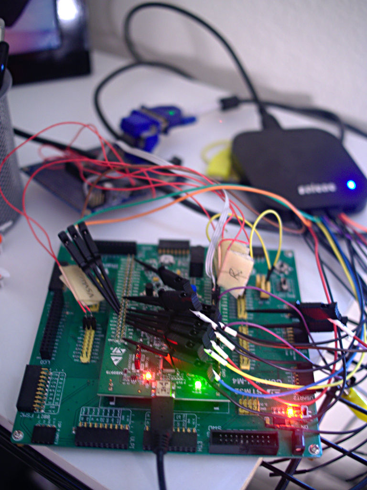
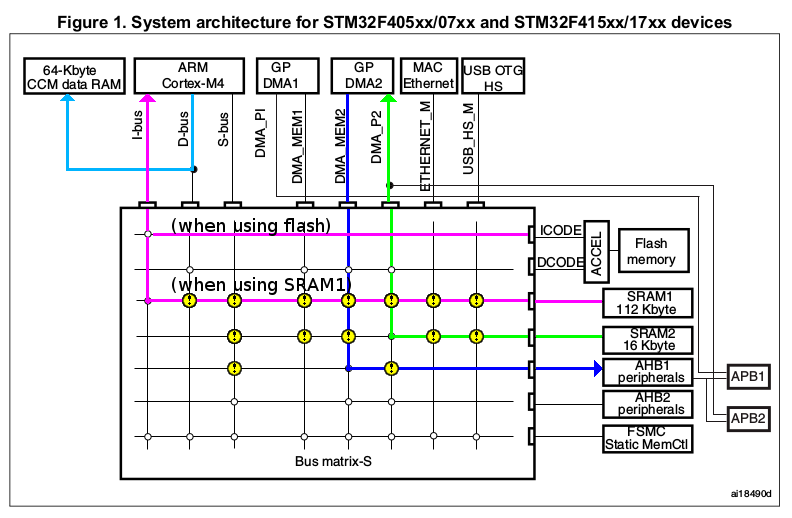

# Introducing Glitch

2015-06-05

Hey, look! I made a little graphics demo!

[](https://youtu.be/7yXxhvKmVb0)

I also wrote the graphics libraries it uses (m4vgalib), because that seemed like fun.

...and the music.

...and the music synthesizer that's playing the music.

...and the music authoring tools for writing the music.

...and the C++ runtime library ([ETL](https://github.com/cbiffle/etl/)).

...and the build system ([Cobble](https://github.com/cbiffle/cobble-build/)).

...oh, I built the computer it's running on, too, based around an STM32F407.

My idea of "fun" is pretty odd, I realize. This is probably why I don't get invited to a lot of cocktail parties.




Glitch is a [demo](http://en.wikipedia.org/wiki/Demo_(computer_programming)) in the sense of the [demoscene](http://en.wikipedia.org/wiki/Demoscene), and a work in progress. The video above shows an abbreviated version --- a sort of trailer. I've been tinkering on Glitch since December, but it's based on my open-source [m4vgalib](https://github.com/cbiffle/m4vgalib/), which has been published for a couple of years now. (You might see some resemblance in this [teaser video from 2012](https://www.youtube.com/watch?v=GKFkxyCj_dM).)

Now, I recognize that some of my readers aren't microcontroller video geeks, and for those readers, I feel like I ought to offer some perspective on why I'm so excited about this. So:

The processor I'm using has no video hardware at all. I'm tricking a monitor into showing real-time color graphics through carefully timed software that abuses some other, unrelated, hardware to push pixels. And, to my knowledge, those pixels I'm pushing are the most that have ever been pushed by a chip in this class[^1]: 60 frames per second of 800x600 color video.

[^1]: By which I mean an STM32F4 without the video option. I saw someone get to 56fps recently, by overclocking. Their approach is similar to mine but has some interesting advantages --- and drawbacks. I'll compare the two approaches in a later post.

No tricks, no overclocking, just very careful programming and a lot of work.

Graphics demos like this are traditionally released at demo competitions like [Breakpoint](http://breakpoint.untergrund.net/), and for a while I planned on doing just that. But when it comes right down to it, I'm just not a competitive person[^2]. So I'm publishing Glitch here instead. And rather than bragging about my 1337 5K1LLZ, I want to show you how the magic trick works, and inspire you to make magic of your own --- perhaps even building on my code.

[^2]: Besides, I would lose. ;-) There's some impressive stuff out there.

I'm working on a [series of posts](http://cliffle.com/tags/glitch-demo/) to walk through the internals of Glitch and m4vgalib, highlighting some of the problems I encountered and the solutions that I chose (and didn't).

I hope you'll see why I find this sort of thing really interesting. :-)


# Pushing Pixels

2015-06-06

*This post is the second in a
[series](http://cliffle.com/tags/glitch-demo/) looking at the design and
implementation of my [Glitch](http://cliffle.com/tags/glitch-demo/) demo
and the [m4vgalib](https://github.com/cbiffle/m4vgalib/) code that
powers it.*

**Updated 2015-06-10**: clarifications from reader feedback.

For the first *technical* part in the series, I'd like to start from the
very end: getting the finished pixels out of the microprocessor and off
to a display.

Why start from the end? Because it's where I started in my initial
experiments, and because my decisions here had *significant effects* on
the shape of the rest of the system.

The standard we call "VGA" isn't really called VGA, and isn't much of a
standard. But it has no good name other than VGA, so I'll stick with
that.

I'll go into more detail about VGA as we need it in future posts, but
here's the short version, filled with Wikipedia links if you want to
read ahead:

[VGA](http://tinyvga.com/vga-timing/800x600@60Hz) is an [analog
video](http://en.wikipedia.org/wiki/Video#Analog_video) standard that
uses [component video](http://en.wikipedia.org/wiki/Component_video)
with separate sync signals. Like most analog video standards, it's
distantly related to [analog television
signals](http://en.wikipedia.org/wiki/Analog_television), which are
themselves an electrical relative of the [mechanical
televisions](http://en.wikipedia.org/wiki/Mechanical_television) of the
late 19th century. Seriously, people built mechanical televisions.
Steampunk, eat your heart out.

Anyway. VGA dominated the industry from 1987 up until about 2005, and is
still ubiquitous — I bet you can find at least one device in your
household with a VGA input or output. (Try the back of your television.)

Generating stable, high-quality VGA video at high resolutions is a
complicated topic — I should know, I've been working on it for three
years — but for today's post, only one part matters: the *pixel clock*.

A VGA monitor expects to receive pixels — more precisely, it expects to
receive changes in three voltages, one each for red, green, and blue.
Each voltage corresponds (hence "analog") to the intensity of the
corresponding color component. The signals are just electrical waves,
without any way of indicating the boundaries between pixels. Instead,
the circuit producing the video (us !) and the one receiving it (a
display) perform an intricate timing dance to agree on a *pixel clock* —
an implicit but shared "beat" that indicates when the voltages represent
one pixel, and when they change to describing the next.

It's really easy to get this wrong, even in professional video hardware.
If you've ever plugged a computer into a display to get fuzzy output,
only to unplug and plug it in again and have things come out sharp,
you've seen the timing dance fail and recover. This is why VGA monitors
have an "autosync" feature or button to retry the dance.

So we need to put effort into getting this right, and it all starts with
producing pixels at one of the standard rates.

In our case, the target is the [VESA 800x600 60fps non-interlaced
mode](http://tinyvga.com/vga-timing/800x600@60Hz), for which we need to
produce pixels at a very precise 40MHz rate — or one pixel every 25
nanoseconds. Shifting the signal by even five nanoseconds in either
direction would visibly mar our beautiful video ! We're going to have to
be careful.

Now let's turn to the hardware we're using.

The STM32F407 is a microcontroller from ST Microsystems, based around
the popular [ARM
Cortex-M4F](http://en.wikipedia.org/wiki/ARM_Cortex-M#Cortex-M4) core.
In terms of compute power, instruction latency, and overall
capabilities, it is *very* much like a late-generation
[486](http://en.wikipedia.org/wiki/Intel_80486), only slightly faster
and from a bizarro world where the 486 was
[RISC](http://en.wikipedia.org/wiki/Reduced_instruction_set_computing).
So if you're reading [Abrash's
book](http://www.jagregory.com/abrash-black-book/) — *and you should* —
stop before the Pentium section.

The STM32F407 variant I'm using has 192 kiB of RAM and 512 kiB of Flash,
which is roughly the amount of storage available in, say, an unexpanded
Commodore 128 or the original Macintosh. But those computers have
something I don't: hardware for producing video. While the '407 also has
a whole mess of interesting peripherals, video generation is not among
them. Which is, of course, why we're here !

The peripherals it *does* have are documented at length — albeit at
varying levels of quality — in the [Reference
Manual](http://www.st.com/web/en/resource/technical/document/reference_manual/DM00031020.pdf).

Did I mention the [Reference
Manual](http://www.st.com/web/en/resource/technical/document/reference_manual/DM00031020.pdf)?

No, really, if you want to follow along with the really fun stuff, stash
a copy of the [Reference
Manual](http://www.st.com/web/en/resource/technical/document/reference_manual/DM00031020.pdf).
While it's not perfect, it's important, and I will refer back to it.

**Note:** Unfortunately, STMicro renumbers sections and figures
willy-nilly between editions of the manual, making it *damn hard* to
refer conclusively to anything in there. Where I need to cite the manual
I will give the section/figure/table number in my copy, plus any titles
or captions to help you track it down in yours. Please send me
corrections if STMicro changes everything again. :-(

Let me draw your attention to two particular items in the Reference
Manual. The first is so important that I'm going to reproduce it
outright, without permission. Behold, the almighty powerful, and
almighty cryptic, **Figure 1**:


This is the AHB bus matrix diagram for the STM32F407 and related chips.
It is not just a pretty face: it's the key to unlocking the full
performance of this chip.

Second, there is **Table 1**, or **STM32F4xx register boundary
addresses**. In my copy of the Manual it's in section 2.3, "Memory Map."
This table tells you, for every peripheral on the chip, which exit from
Figure 1's AHB Matrix to use to access it. As a normal programmer you'd
rarely need this information — but if you're still reading, you are
either an abnormal programmer, or *soon will be.*

We need a way of making three analog signals — red, green, and blue —
produce around 40 million samples per second (MS/s). A quick skim of the
[Reference
Manual](http://www.st.com/web/en/resource/technical/document/reference_manual/DM00031020.pdf)
shows that the STM32F407 has a bazillion peripherals of various kinds;
how many of them are relevant here?

None of the analog output peripherals, that's for certain: there are
only two DAC channels, and they top out at just 1 MS/s. So we'll have to
produce digital output and convert it to analog voltages outside the
chip.

We need *n* parallel output bits to display *2^n^* colors. 256 colors
seemed like a reasonable place to start, but I kept an eye out for
anything that would let me do 16-bit (65,536 colors on screen). Two
peripherals seemed to fit the bill:

  - The "Flexible Static Memory Controller," or FSMC.
  - The GPIO ports.

On previous video projects I had used things like SPI controllers to
generate monochrome video. While this sticks you with monochrome, it has
a big advantage: these controllers often have built-in
[FIFOs](http://en.wikipedia.org/wiki/FIFO_\(computing_and_electronics\)#Electronics),
or at the very least a wide shift register. This lets you compute a few
pixels' worth of the image (often 32), stuff it into the FIFO, and go
off and do other things, freed (for now) of your real-time obligations
to the display.

On the STM32F4, neither the FSMC nor the GPIO have FIFOs. But that's
okay, because also featured in the Reference Manual is the General
Purpose DMA Controller. We can use DMA to set up flows of data between
memory and any peripheral, including FSMC and GPIO.

So which one's better? The answer surprised me. But first, an aside on
the pecularities of the STM32F4 DMA controller.

## A quick DMA refresher

In case you haven't used
[DMA](http://en.wikipedia.org/wiki/Direct_memory_access) before, a DMA
controller is sort of like a really simple second processor that can be
programmed to do a single thing: copy bytes from one address to another.
It can do this without hassling the main processor for help, hence
*direct* memory access. The STM32F4's DMA controller is *relatively*
fancy, as these things go, but still pretty simple.

DMA is mediated by DMA Requests, or DRQs. They're like IRQs for the main
processor, but they trigger behavior in the DMA controller instead. In
the case of the STM32F4, each DRQ can trigger a single "transfer," which
is a copy of a (small) configurable number of bytes from one place to
another.

When you program the DMA controller to do your bidding, you set a
"number of data items" counter. Every time a DRQ happens, the DMA
controller decrements it. When it reaches zero, the transfer is marked
"complete" and further DRQs are ignored until it's turned back on.

I remember DMA controllers being pretty intimidating when I first
started doing embedded programming, but they're not hard — just a little
tedious. They are now my bestest friend, to the point that I just don't
reach for processors without good general DMA controllers anymore.

## DMA on STM32F4 (or: when is direct memory access not direct?)

To blow some data out a port (GPIO or FSMC) under DMA control on an
STM32F4, the basic procedure looks something like this:

1.  Turn on the DMA controller and your peripheral.

2.  Pick a DMA Stream to use.

3.  Arrange to have its associated DRQ strummed periodically.

4.  Turn it on.

5.  Kick back.

Simple ! And this is where things get tedious, with a good bit of
[Reference
Manual](http://www.st.com/web/en/resource/technical/document/reference_manual/DM00031020.pdf)
cross-referencing. :-)

First, pick which DMA stream you want to use. There are 16 such streams,
8 on each of two DMA controllers. Each of the 16 streams can have its
own transfer ongoing, independent of the others. However, you can't pick
just any stream.

If you refer to the almighty Figure 1 again, you'll notice the two DMA
controllers at the top. Each has two ports emerging from its underside;
ST calls these ports the "memory" and "peripheral" ports, and they are
bus masters.

The big block in the middle of Figure 1 is the *AHB Bus Matrix*. I'll
take a closer look at the matrix in a future installment. The key for
now: nothing, the CPU included, really has *direct* access to memory.
It's all intermediated by the bus matrix.

But note that GPDMA1's peripheral port doesn't actually connect to the
bus matrix. Instead, it runs off to the right, bypassing the matrix and
connecting directly to APB1. This means that, while GPDMA1's "memory"
side can talk to all sorts of memory, GPDMA1's peripheral side can only
talk to peripherals on the APB1 bus.

Which is bad, because — according to Table 1 — *none* of the peripherals
we're discussing live on APB1.

GPDMA2's peripheral port also has a line running off to the right
(eventually ending up in APB2), but that line forks, and *also* joins
the AHB matrix fabric as a master. So GPDMA2's peripheral port is more
general than GPDMA1's: it can talk to a variety of things through the
matrix, including peripherals that live directly on AHB instead of APB.

Since (per Table 1) the GPIO lives on AHB1 and the FSMC on AHB3, if you
want to talk to either through the peripheral side of the DMA stream,
you'll have to use GPDMA2.

Great, we're using GPDMA2 ! But we can't use just *any* stream on
GPDMA2. The table in the [Reference
Manual](http://www.st.com/web/en/resource/technical/document/reference_manual/DM00031020.pdf)
(section 10.3.3, "DMA2 Request Mapping") shows which DRQs can drive
which streams. So you need to figure out where your DRQ is coming from
and pick a compatible stream. (I'll skip the details; in my case, the
answers are — at least initially — "TIM8" and "Stream1".)

From here, it's just paperwork: poking the right values into the DMA
Controller configuration registers and the DMA Stream configuration
registers. There are a lot of little bit fields to consider, but only
about four registers in total.

Two of those registers are the "memory address" and "peripheral address"
registers. For now, assume that the "memory address" is some pixel data
in RAM, and the "peripheral address" is one of the registers in the GPIO
or FSMC space. This means we need to set the direction (`DMA2.SxCR.DIR`)
to "memory to peripheral."

If it seems like I'm descending to a fine level of detail here, stay
with me: the reason will become apparent shortly.

## Pushing pixels through the FSMC

To ST's credit, the "Flexible" FSMC really is pretty flexible. You can
configure it to act like a simple parallel bus. Perfect !

We can also get it to run up to about 50% of the CPU frequency, which
might allow for pixel clocks of up to 82 MHz. Neeeeeat.

So we do all that DMA stuff I just described, and point the DMA
controller at the FSMC's memory region after configuring the FSMC. We
can pretty much point the DMA "peripheral address" *anywhere* in the
range of addresses `0x6xxx_xxxx` , because we're just using the "data"
outputs, not the address.

What do we get?

We get bursty output, at any speed.

It appears that the FSMC needs to breathe for one AHB cycle between
external bus bursts. It cannot sustain 100% utilization. While a burst
can be as long as 16 bytes, it still means we lose one AHB cycle — a
significant fraction of a pixel — every 16 pixels. This produces
unacceptable phase shift and banding in the output image.

Moreover, the FSMC isn't available, or is severely curtailed, on
STM32F407 chips in smaller packages. Such chips are less tedious to
solder, so it'd be nice to be able to use them.

So the FSMC's a no-go, despite its promise.

## Pushing pixels through GPIO

This leaves the boring old GPIO controller as our only hope.

At first, I wondered if the GPIO ports would be fast enough. My initial
experiment was not promising. I set up one of the faster timers (`TIM8`)
to generate DRQs as fast as it could, but I couldn't seem to get bytes
sent by DMA through GPIO any faster than one per eight AHB clock cycles.

In fact, by adjusting the timer settings, I could get any consistent
divisor... as long as it's greater than eight.

If that's the speed limit, it caps the maximum frequency at 21MHz for
this part, which can run the AHB at up to 168MHz. That's not even fast
enough for 640x480 VGA !

But the DMA controller can read and write different sizes of transfers
using its FIFO. Configuring it to do a single 16 bit read from RAM for
every two 8 bit output writes, stashing the extra byte in the FIFO until
it's needed, increased the rate to 1/5 the AHB rate, or 33.6 MHz. (I was
disappointed by this rate and didn't measure jitter, but I suspect it
was not stable.)

I thought I had reached a fundamental limit of either the DMA controller
or the GPIO port — a fundamental limit that would put 800x600 out of
reach.

Out of frustration, and inspired by an STM32F4 demo I saw on the
internet, I tried this:

    ldrb r2, [r0], #1
    strb r2, [r1]
    ldrb r2, [r0], #1
    strb r2, [r1]
    ldrb r2, [r0], #1
    strb r2, [r1]

...over and over, 800 times, with `r0` set to some pixel data, `r1` set
to the GPIO `ODR` register, and `r2` acting as a temporary.

I got rock-solid output at ¼ the AHB rate. That's 42MHz, or just fast
enough. So the GPIO, at least, *could* keep up at my targeted rate.

Except that I was using 100% of the CPU to do it — a pyrrhic
implementation. Could I do interesting graphics just during the
horizontal blanking period?

Maybe, but it seemed like a huge waste. DMA really seemed critical to
getting a useful implementation. My notes from this point in the
experiment end in a little sadface.

But then something occurred to me.

## What's a peripheral, anyway?

Okay, so each DMA stream has a "peripheral" end and a "memory" end. What
does that really mean — beyond which master port on the controller gets
used?

The [Reference
Manual](http://www.st.com/web/en/resource/technical/document/reference_manual/DM00031020.pdf)
is coy on this point, but you can tease it out if you squint. Turns out
it's really simple, at least for GPDMA2, which (as discussed above) is
both...

1.  The only controller with *two* AHB master ports, *and*
2.  The only controller we can reasonably use to produce video.

To use a C analogy, the DMA controller treats the peripheral side as
`volatile` — it will read from it, or write to it, only as requested by
the DRQ. Whereas, on the "memory" side, the DMA controller is free to
read in advance into the FIFO, or dribble out buffered data after it's
captured by a DRQ.

That's it. Since all peripherals on ARM are memory-mapped, the DMA
controller doesn't make any further distinction between peripheral and
memory.

This means it's actually possible to use GPDMA2's "memory-to-memory"
transfer mode, where it doesn't use DRQs at all, *to move data into a
peripheral*. It just runs full-tilt, restricted only by the speed of the
"memory" at either side.

## The DMA Controller, unleashed

When configuring the DMA controller for a memory-to-memory transfer, the
source address goes in the "peripheral address" side of the stream, and
the destination address, in the "memory address" side.

We can configure maximum speed DMA from RAM to GPIO by,
counter-intuitively, setting RAM as "peripheral" and GPIO as "memory."
This is merely a product of poor naming by STMicro; while it appears
backwards, it is not significant.

How fast can the DMA controller transfer data from SRAM to GPIO if it
doesn't have to worry about DRQs and peripheral timing? At a rate of one
GPIO write every 4 AHB cycles. Consistently.

(The DMA controller can actually go faster than this for SRAM-to-SRAM
transfers... but, surprisingly, not a lot faster. More details on that
in a later post.)

At the chip's maximum rated speed of 168MHz, this gives us a 42MHz pixel
clock. No standard video mode I could find uses a 42MHz pixel clock. The
800x600 mode I was targeting wanted 40MHz. Which brings me to one of the
implications of unleashing the DMA controller:

*We can't slow it down.*

You're going to get pixels at ¼ the CPU rate whether you like it or not.

Which suggests a way of reducing the pixel clock: you slow down the
*entire system*. And, in fact, my published demos do just that,
underclocking the CPU to 160MHz.

Of course, we're not done. Now we can push bytes from RAM at 40MHz —
it's a great start ! But now we need to *frame* the pixels by generating
sync signals. And, of course, we need to render some graphics into the
bytes we send !

Thanks to an apparently innocuous choice I made above, doing that is a
lot harder than it looks ! Part 3 will describe how to build a useful
rasterizer on top of our little DMA tech demo, and how to avoid the apex
predator of the real-time ecosystem: **jitter bugs**.

Stay tuned !

- [embedded](http://cliffle.com/tags/embedded/)
- [glitch-demo](http://cliffle.com/tags/glitch-demo/)
- [graphics](http://cliffle.com/tags/graphics/)
- [hardware](http://cliffle.com/tags/hardware/)


# A Glitch in the Matrix

2015-06-10

*This post is the third in a
[series](http://cliffle.com/tags/glitch-demo/) looking at the design and
implementation of my [Glitch](http://cliffle.com/tags/glitch-demo/) demo
and the [m4vgalib](https://github.com/cbiffle/m4vgalib/) code that
powers it.*

In [part two](http://cliffle.com/article/2015/06/06/pushing-pixels/), I
showed a fast way to push pixels out of an STM32F407 by getting the DMA
controller to run at top speed. I described the mode as follows:

> It just runs full-tilt, restricted only by the speed of the "memory"
> *\[or memory-mapped peripheral\]* at either side...

But there's a weakness in this approach, which can introduce jitter and
hurt your video quality. I hinted at it in a footnote:

> ...and traffic on the AHB matrix, which is very important — I’ll come
> back to this.

Quite a bit of [m4vgalib](https://github.com/cbiffle/m4vgalib/)'s design
is dedicated to coordinating matrix traffic, while imposing few
restrictions on the application. In this article, with a minimum of
movie puns, I'll explain what that that means and how I achieved it.

## What is the Matrix?

Here comes our old friend from [part
two](http://cliffle.com/article/2015/06/06/pushing-pixels/), Figure 1.


The large rectangle that dominates Figure 1 is the AHB matrix. It is the
central interconnect of the STM32F407, determining which parts of the
chip can talk to which others. For example, in part two, I used the
matrix diagram to explain [why we can't use GPDMA1 to push
pixels](http://cliffle.com/article/2015/06/06/pushing-pixels/#dma-stm32f4)
— it simply doesn't have enough connections to the matrix.

Beyond that, the connections the matrix *does* have are not "fully
interconnected." Not all masters (along the top) can talk to all devices
(at right). Data can only flow from a column to a row through a *switch*
— shown in the diagram as a little white circle. If you can start at a
master, trace down to a white circle, and then trace right to a device,
then the master and device can communicate. Otherwise, no luck: there
may be an overcrossing, but there's no off-ramp.

AHB matrices like this are a common feature of Cortex-class
microcontrollers, and when trying to get maximum performance from one,
it *always* pays to study the matrix diagram closely, if one is
available.

## How to mess up the flow of pixels

To sustain a 40MHz pixel rate, we're pumping a fair amount of data
through the matrix — but we're not using the whole thing. The flow of
pixels only involves three players:

1.  GPDMA2.
2.  One of the AHB-attached SRAMs.
3.  A GPIO port, all of which are on the AHB1 bus.

The rest of the matrix is idle, or doing something we haven't yet
discussed.

I find it helps to visualize the flow of data across the matrix, like
this:


I've scribbled a bit on Figure 1 here — the green line indicates the
flow of data read from SRAM by GPDMA2, while the blue indicates writes
to the GPIO port. We're making use of two matrix switches, at the elbows
of the two flows.

Ah, but what are all those little yellow icons? They've appeared atop
some of the switches — specifically, all the rest of the switches in the
two matrix rows we're using.

These are *matrix hazards*.

You see, each device can be used by only one master at a time, and each
master can only use one device at a time[^1device]. Put
another way, only one switch in each row/column can be active at a time.
If one master is using a device, and another master decides that they
would like to use it, too, then we have a
conflict[^selfconflict]</sup>.

[^1device]: When I say "a master" here, I'm referring to a master port on the
    matrix, not a particular logical block inside the chip. Some blocks,
    namely CPU and DMA, own multiple master matrix ports.

[^selfconflict]: And yes, it is entirely possible for a system with multiple master
    ports, like CPU and DMA, to *conflict with itself.*

It's up to the matrix to decide who wins these conflicts, through a
process called
[arbitration](http://en.wikipedia.org/wiki/Arbiter_%28electronics%29). A
variety of strategies are possible: the masters could be prioritized;
the requests could be handled in the order they're received by the
matrix; or the matrix could just pick a new master every cycle in a big
circle.

Unfortunately, ST doesn't specify the bus arbitration method used in the
STM32F4, much less give us control over it[^arbitcontrol].
However, from my experience, I know this much: if another master
expresses interest in either SRAM2 or AHB1 while GPDMA2 is transferring,
the matrix will begin interleaving the transfers of the two masters.
Depending on the type of transfer being performed, each time the other
master is given access to SRAM2 or AHB1, the GPDMA2 gets stalled by *at
least* one cycle.

[^arbitcontrol]: If they did, this article would be a lot shorter. CPUs with configurable
    bus arbitration, like the NXP LPC1788 (*not* 1768), are much easier to
    squeeze for every last drop of performance.

Conflicts cause stalls, and stalls cause *late pixels.* Slightly late
pixels are effectively a phase shift, with respect to the 40MHz pixel
clock; they will show as a slight fuzziness in the image on an LCD
monitor or a nice CRT, and may not be visible at all on an older CRT. As
pixels get later, the visual artifacts get worse, stretching sections of
the display to the right. In extreme cases, this can shift video into
the blanking interval, which can throw off the monitor's automatic gain
control and distort the whole frame.

So how late do the pixels get when we have a conflict? Well, it depends
on the conflict. Let's take a look at each of the conflicts that can
affect m4vgalib's scanout performance, and the methods I used to
mitigate each one.

## AHB1 port conflicts

While pixels are flowing, any other master that attempts to access AHB1
will interfere with the flow. Of the conflicts we'll discuss, this one
is the easiest to cause, for two reasons:

1.  There's a lot of *useful stuff* on AHB1. In particular, it's the
    only path by which the CPU can access APB peripherals, via the
    AHB-APB bridges. AHB1, APB1, and APB2 together host *most* of the
    peripherals on this chip !

2.  While the AHB bus itself is pretty fast, devices *on* the bus can
    slow it down by generating [wait
    states](http://en.wikipedia.org/wiki/Wait_state). You can reach the
    SRAMs over AHB with zero wait states, but the GPIO appears to
    generate three, for four cycles total. Devices reached through the
    AHB-APB bridge are slower, because the APB buses in the STM32F407
    can't run as fast as AHB — so accesses to such peripherals cost 2x
    or 4x more, depending on the bus, *plus their wait states*.

Not only is it easy to trigger by accident, this conflict has the
biggest negative impact on video quality. Unlike writes to memory,
writes to GPIO are externally visible — so stalling them will stall the
external signals[^stallgpio]. The SRAM end of the
transfer, on the other hand, can get nudged around by a cycle or ten
with nobody being the wiser. (Though it can still be impaired by
conflicts — more on that in the next section.)

[^stallgpio]: This conflict is easier to trip in m4vgalib's high-resolution modes
    because of my decision to run the DMA outside the control of a timer
    counter. However, it affects *all* high-rate DMA to an external
    interface, whether it be GPIO, SDIO, or something else, even when a
    synchronizing DRQ is used. If you want to get maximum throughput, you
    must be conscious of this matrix conflict !

At left, a polygon edge corrupted by *a single AHB1 write* during
scanout. At right, the same edge without the conflict.


So far, I've only found one solution that works 100% of the time: *only
touch AHB1 during blanking intervals,* either horizontal or vertical.
This implies that any high-rate peripheral activity needs to be handled
during hblank, and slower stuff can be done in vblank. m4vgalib does not
*enforce* this in any way[^mpu]. Instead, I've provided
some tools to make it easy to do the right thing.

[^mpu]: I've considered having m4vgalib use the Cortex-M4 Memory Protection Unit
    to block off AHB1's address space, and then reveal it on entry to
    blanking periods. This would help application authors find access bugs
    faster, but it conflicts with the use of the MPU by most operating
    systems. Applications can surely do this for themselves !

m4vgalib lets applications synchronize to the start of the vertical
blanking interval with the `vga::sync_to_vblank()` function. Immediately
after this function returns, the application has a millisecond or so do
work without interference from the video driver. This is most often used
to achieve tear-free rendering, by e.g. flipping between buffers during
vblank — but it's also a good opportunity to interact with low-speed
peripherals. In the example demos, it's what I use to poll for user
input: the buttons are attached to GPIO lines, so to read them, I have
to touch AHB1.

Synchronizing with the horizontal blanking interval is a harder problem.
At 800x600, hblanks happen 37.8 *thousand* times per second, and
whatever it is that the application wants to do during hblank had better
be complete within a few microseconds. I assumed that applications would
generally be written around a main loop synchronized with vblank. So
m4vgalib does not provide a `sync_to_hblank` call. Instead, m4vgalib
simulates an hblank *interrupt*: applications can define a function
named `vga_hblank_interrupt`, and m4vgalib will call it early in the
hblank, in interrupt context[^hblankprio]. The [`serial`
example
demo](https://github.com/cbiffle/m4vgalib-demos/tree/master/demo/serial)
uses this to handle serial input;
[Glitch](http://cliffle.com/tags/glitch-demo/) uses it to output audio
samples.

[^hblankprio]: Specifically, `vga_hblank_interrupt` gets called from the PendSV
    interrupt handler.

## SRAM2 port conflicts

Any access to SRAM2 while pixels are flowing will limit the DMA's
ability to slurp pixel data, which can starve writes to the GPIO and
thus cause visible artifacts. Compared to AHB1, this conflict is
significantly harder to trigger in practice, both because of the
different nature of the hardware on this end of the flow, and because of
mitigation measures built into m4vgalib.

SRAM is faster than GPIO, in general[^sramfast]. The
STM32F407's SRAM is all zero-wait-state SRAM, meaning that it can
complete a transfer in a single CPU/AHB clock cycle. However, SRAM
accesses can stall the bus matrix for more than this would suggest, if
the accesses are part of a
[burst](http://en.wikipedia.org/wiki/Burst_mode_\(computing\)).

[^sramfast]: If it were not, we would be able to sustain a 160MHz pixel clock. Some
    of the Cortex-M0+ parts have zero-wait-state GPIO, a trend that I hope
    eventually expands to the higher-end Cortex processors.

Bursts are *uninterruptible* sequences of transfers over the AHB bus:
the matrix arbiter will not interrupt a burst to give a different master
access. Bursts occur in the following cases:

1.  **Explicit burst transfers.** You can configure the DMA controller
    to access memory (or anything, really) in bursts of 4, 8, or 16
    transfers, multiplying the latency of the accesses by 4, 8, or 16
    (respectively).

2.  **Implicit burst transfers due to unaligned access.** The Cortex-M4
    allows programs to perform unaligned memory
    accesses[^unalign]. The AHB bus that connects the CPU
    to memory, however, does not — so the M4 must simulate unaligned
    accesses by making multiple, aligned, accesses. To make this appear
    as an atomic operation to the software, these transactions are
    combined into a burst. An unaligned read costs 2x; an unaligned
    write, 4x (a read-modify-write operation on two words of memory).
    
[^unalign]: Unaligned accesses can be disabled on the Cortex-M4, which removes
    the potential for this surprise. I leave it enabled in practice
    because it's useful for packing data structures — and I find RAM to
    be more of a limiting reagent than CPU.

3.  **Implicit burst transfers due to bitbanding.** The Cortex-M4 has a
    special area of its address space, the
    [bitbanding](http://spin.atomicobject.com/2013/02/08/bit-banding/)
    region, that provides a sort of magnifying glass for SRAM: each word
    in the bitbanding region maps to a single bit in SRAM. This lets
    applications manipulate single bits in memory atomically without
    special instructions or intrinsics — m4vgalib leans heavily on this
    in its 1bpp line-drawing code. But bitbanding isn't free. Like
    unaligned accesses, bitbanding is a fiction presented to software by
    the CPU; AHB knows nothing of it. Bitband writes, specifically,
    cause a burst of two transactions — one read, one write.

(You might suspect that a 64-bit access on Cortex-M4, e.g. through
`ldrd`, would also generate a burst transfer — but this does not appear
to be the case.)

Even with these cycle-stealers lurking, it's still *pretty hard* to
bottleneck a transfer on the SRAM side — even with significant and
repeated conflicts.

How hard is it? In preparation for writing this article, I ran an
experiment. I disabled *all* of m4vgalib's SRAM conflict mitigation
measures (described below). I then ran the `conway` demo and used my
[Saleae Logic Pro](http://saleae.com/) to monitor the video timing with
5ns resolution. (`conway` produces the most AHB matrix traffic of all
the example demos, so it's a good stress test.)

On average, I was able to elicit three cycles of conflict, or about
20ns, in each video line. This is less than a pixel; you might not even
notice. *But I noticed*, because I am *neurotic* about this sort of
thing. So I built in the following mitigation measures:

1.  **Use separate pixel RAM.** You might have noticed that I've been
    talking about streaming pixels from SRAM2, and not the larger, more
    comfortable SRAM1. This is deliberate. m4vgalib accumulates pixels
    in SRAM2 during hblank and streams them from there, so that the
    application can make free use of SRAM1 (and CCM) without risk of a
    matrix conflict. (Reducing contention for SRAM1 also has another
    benefit, discussed in the next section.)

2.  **Discourage applications from placing stuff in SRAM2.** The linker
    script used by the example demos distributes user data between CCM
    and SRAM1, leaving SRAM2 for the exclusive use of
    m4vgalib[^contig]. However, since it's technically
    safe to use SRAM2 during blanking intervals,
    [Glitch](http://cliffle.com/tags/glitch-demo/) uses it to store
    audio mixing buffers. You can do this too — you just have to be
    careful.
    
[^contig]: Because SRAM1 and SRAM2 are contiguous, it's tempting to treat them
    as a single 128kiB RAM. Many vendor linker scripts do this by
    default. But because the two RAMs have different properties and are
    accessed through different matrix ports, this isn't a good idea in
    high-performance situations.

3.  **Enable the DMA FIFO.** Because SRAM is faster than GPIO, the DMA
    controller can "get ahead" on the SRAM side if it has somewhere to
    stash extra pixels. The FIFO provides such a place.

4.  **Use 32-bit accesses to SRAM.** Yes, you could program the DMA
    controller to read a byte from SRAM, write a byte to GPIO, and
    repeat — but since the SRAM is natively 32 bits wide, that would
    waste ¾ of the SRAM bandwidth. Instead, m4vgalib has the DMA read
    SRAM into the FIFO in word-sized units, before dribbling them out to
    GPIO in bytes. (The DMA controller, like the rest of the system,
    does this in
    [little-endian](http://en.wikipedia.org/wiki/Endianness) order.)

m4vgalib's mitigation measures here are arguably redundant, a sort of
belt-and-suspenders situation — either measures 1 and 2, *or* measures 3
and 4, do a pretty good job eliminating conflicts — but I didn't want to
have to worry about this *ever again*.

With all four measures active, I haven't been able to create an
SRAM-based conflict that interferes with the video in a way I can see or
measure. And I've done some truly demented things to try to elicit one.

## How to mess up an entire scanline

There's another lurking beast that can damage video quality. There are a
class of conflict that arise, not from masters fighting over the AHB
matrix, but from the CPU tripping over itself. They can insert jitter
into innocent-looking code in ways that can change from one compilation
to the next ! These are the last class of conflicts that I hunted down
during the construction of m4vgalib, and the most subtle.

Fortunately, you can avoid them — once you understand them.

## Flash wait states

The STM32F407 has quite a bit of Flash, by microcontroller standards —
512 kiB in my version. The chip boots out of Flash, and while it is
possible to copy some code into RAM (specifically, SRAM1) and run it
there, RAM is so much smaller that running code out of Flash is usually
the right thing to do.

But Flash is slower than RAM. On the STM32F4 series, as you crank up the
CPU speed, the Flash speed stays the same, limited by physics. At
m4vgalib's recommended CPU speed of 160MHz, Flash is *six times slower*
than the CPU. This means it has to add [wait
states](http://en.wikipedia.org/wiki/Wait_state) when the CPU accesses
it — five, to be exact.

If every read from Flash took six CPU cycles, no performance-oriented
programmer would want to run code from Flash — it would turn our
beautiful 160MHz processor into a 26MHz processor ! ST foresaw this, and
provided a system they call the *flash accelerator* ([Reference
Manual](http://www.st.com/web/en/resource/technical/document/reference_manual/DM00031020.pdf)
section 3, "Embedded Flash Memory Interface").

The flash accelerator maintains two small caches, similar to the L1
cache in a modern microprocessor: one for data, and one for code. More
precisely, there is one cache for accesses made through the CPU's I
port, and one for accesses through the D
port[^sportflash]; that's basically the same as saying
"one for code and one for data," with one exception that we'll discuss
in a bit.

[^sportflash]: The CPU's other port, the S port, cannot reach Flash. You can see this
    in Figure 1.

If the data you're loading from Flash is in cache, the access is as fast
as SRAM — one cycle, no wait states. If the data is *not* in cache, you
pay the additional five cycle penalty.

In general, this is a *really good thing*. The flash accelerator
contains prefetch logic that tries to have the next chunk of code
waiting in cache before it executes[^arev]. Since the
processor also tries to prefetch code before it's needed, the two
systems work together, and they work well: in general, moving code to
RAM doesn't make it run faster on an STM32F407.

[^arev]: If you're using the A revision of the STM32F407, the prefetch circuit is
    broken. m4vgalib was originally developed on the A-rev, and as a result
    it puts more code in RAM than is strictly necessary. I'm gradually
    cleaning this up as time allows; any board you buy today should contain
    the newer Z-rev or 1-rev (ST counts strangely). Remember: *always check
    the [errata](http://www.st.com/web/en/resource/technical/document/errata_sheet/DM00037591.pdf).*.

However, like any cache, it's possible to sneak up on it and request
some data it wasn't expecting. The particular case of this that concerns
us here: *interrupt handlers*.

I mentioned that there was an exception to the general rule that the
I-port is used to fetch code: the I-port is *also* used to fetch vector
table entries. This means that when an interrupt occurs, the CPU
performs the following operations:

1.  Loads the vector table entry (I-port).
2.  Uses that address to load the first instructions of the ISR (also
    I-port).
3.  Writes the contents of 8 registers out to the interrupt stack
    (D-port).

(The D-port and I-port accesses can happen *at the same time*, a trick
which is partially responsible for the Cortex series' low interrupt
latency.)

Now, if the vector table is in Flash, the vector table fetch hits the
I-cache in the flash accelerator, and *almost certainly misses*. The
cache only holds 1024 bytes, so if the program has executed at least 512
instructions since the last time this
interrupt[^otherirq] occurred, the vector table entry
won't be in cache. Bam, five cycles spent.

[^otherirq]: Or another interrupt whose vector table entry and/or ISR instructions
share cache lines with the new interrupt.

If the vector table entry isn't in cache, chances are pretty good that
the ISR it points to has *also* fallen out of cache. Bam, five more
cycles[^fetchoverlap].

[^fetchoverlap]: In practice, these cycles of latency can overlap with the stacking of
    registers through the D-port, so they may be hidden.

The worst thing about this latency hit is that it's unpredictable, in
two ways. First, if an interrupt occurs frequently, it may hit cache —
but if it slows down it will start taking longer. Second, if a rebuild
of the software changes which 128-bit cache lines hold the data in
question, it may either be cached more often — because nearby data is
cached — or less often. So this 5-to-10 cycle penalty can actually
change when software is recompiled.

m4vgalib contains a single latency-sensitive interrupt: the one
generated at the end of hblank and used to start the flow of pixel data
through the DMA controller. We can't tolerate a variable latency of up
to 10 cycles here, because it would shift the video to the right by just
over two pixels ! To avoid this, m4vgalib keeps both the vector table
*and* the latency-sensitive interrupt handler in SRAM1.

m4vgalib goes one step further, actually: all of the code called on
driver interrupt paths is in SRAM1. This isn't to improve m4vgalib's
performance — as I said above, code in RAM rarely runs faster. No,
m4vgalib does this to improve the *application's* performance: to avoid
polluting the I-cache on every interrupt.

If the interrupt stack also lived in SRAM1, the CPU would have to wait
to stack registers until the vector table fetch and code fetch were
complete. But remember that registers are stacked through the D-port,
which has access to the 64 kiB Closely Coupled Memory, or CCM (upper
left in Figure 1). m4vgalib places the interrupt stack in CCM to avoid
this conflict.

## Let's do the time warp again

Even with your vector table and ISR in SRAM, you may *still* observe
variation in interrupt latency.

One of the factors is one I've beaten to death in this article: AHB
matrix conflicts. Accesses from the CPU to Flash and SRAM have to
traverse the matrix, so the same factors that can affect DMA can also
affect interrupt latency. Fortunately, the devices accessed during
interrupt dispatch are separate from the ones m4vgalib uses for scanout,
so interrupt activity doesn't directly interfere with DMA.

To visualize this, here's another matrix diagram. The green and red
lines still indicate the flow of pixel data. The new aqua line shows the
flow of registers from the CPU to the interrupt stack (in CCM, because
that's where m4vgalib puts it), and the purple line, the flows of vector
table and instruction data into the CPU (assuming it comes from SRAM1,
as in m4vgalib).



These flows do not conflict. However, two classes of conflict can still
arise:

  - **Implicit bursts.** Recall from earlier in this article that
    unaligned accesses and bitbanding both generate AHB burst
    transactions. If an interrupt occurs while a burst transaction is
    underway, any part of the interrupt dispatch process that conflicts
    with the burst is delayed. In practice, this typically means an
    unaligned access in SRAM1 delaying the fetch of the vector table
    entry from SRAM1.

  - **Flash accesses in the application.** If code issues a Flash access
    that misses cache, it takes a five-cycle penalty — and so does
    anything else trying to use the same resources. This not only means
    that accesses to the Flash would be delayed, but that any accesses
    *using the same port on the CPU* would be delayed. So an application
    running from Flash can delay m4vgalib's interrupt handlers, even
    though they live in SRAM, because the vector table fetch must wait
    for the wait states on the I-port to elapse.

Finally, there's a subtle property of the Cortex-M4 processor that can
actually cause interrupt latency to unpredictably *decrease*: [tail
chaining](http://infocenter.arm.com/help/index.jsp?topic=/com.arm.doc.ddi0337e/Babjagdg.html).
If a previous interrupt (perhaps handled by the application) is ending
just as a new interrupt is arriving, the processor effectively jumps
from one ISR to the other, and doesn't bother stacking registers again.
This shaves six cycles off the interrupt latency — but only when two
interrupts occur close together !

This all seems like a bit of a pickle. I don't want to impose
restrictions on how applications are built: they should be allowed to
run from Flash, and they shouldn't have to idle waiting for m4vgalib to
take a latency-sensitive interrupt. Moreover, the tail-chaining timewarp
is almost impossible to predict. What to do?

m4vgalib eliminates both sources of latency through a mechanism I call
the "shock absorber." The idea is simple: just before a
latency-sensitive interrupt arrives, schedule a *second* interrupt, at a
slightly lower priority. This interrupt's handler just executes the ARM
wait-for-interrupt instruction, or `wfi` — idling the CPU. This gives
any (CPU-initiated) AHB transactions time to complete before the
latency-sensitive interrupt arrives. When it arrives, it will preempt
the `wfi` instruction, which will resume (returning from the shock
absorber) when the other ISR completes. Because of the `wfi`, we know
that the CPU's I-port and D-port are both idle in time for the vector
fetch.

In the specific case of m4vgalib, just before the timer interrupt fires
to start DMA, a *second* timer interrupt fires and runs the shock
absorber code to idle the system.

This is probably the strangest thing I've done in
m4vgalib[^strange], but it works great — it eliminated
the last detectable source of jitter in the system.

[^strange]: I have done [stranger
things](https://www.youtube.com/watch?v=5mD6m3V02n8) elsewhere.

## Coming Up Next

That concludes our whirlwind tour of the forces that can corrupt video
output on an STM32F407, and the mechanisms m4vgalib uses to mitigate
them. In the next part, we'll move up a level and look at m4vgalib's
rasterization framework. If this post was too heavy on hardware for you,
the next post may be more your speed: parts will be written in assembly
language ! Stay tuned.

- [embedded](http://cliffle.com/tags/embedded/)
- [glitch-demo](http://cliffle.com/tags/glitch-demo/)
- [graphics](http://cliffle.com/tags/graphics/)
- [hardware](http://cliffle.com/tags/hardware/)


# Racing the Beam

2015-06-16

*This post is the fourth in a
[series](http://cliffle.com/tags/glitch-demo/) looking at the design and
implementation of my [Glitch](http://cliffle.com/tags/glitch-demo/) demo
and the [m4vgalib](https://github.com/cbiffle/m4vgalib/) code that
powers it.*

In [part three](http://cliffle.com/article/2015/06/11/matrix/) we took a
deep dive into the STM32F407's internal architecture, and looked at how
to *sustain* the high-bandwidth flow that we set up in [part
two](http://cliffle.com/article/2015/06/06/pushing-pixels/).

Great, so we have pixels streaming from RAM at a predictable rate — but
we don't have enough RAM to hold an entire frame's worth of 8-bit
pixels ! What to do?

Why, we generate the pixels as they're needed, of course ! But that's
easier said than done: generate them *how*, and *from what?*

In this article, I'll take a look at
[m4vgalib](https://github.com/cbiffle/m4vgalib/)'s answer to these
questions: the *rasterizer*.

I've gotten some reader feedback from the earlier parts of this series —
mostly positive, thanks !

But one question comes up often enough that I feel like I ought to
address it here. It goes something like this:

> Why did you pick the STM32F407 when \[other chip name here\] has more
> RAM, video hardware, and/or can also be used as a dessert topping?

It's a great question, with an odd answer.

I picked the STM32F407 for this project, not because it was easy, but
*because it was hard.*

I like weird graphics chipsets, but I was born late enough that I never
had an Amiga or an Atari ST. Indeed, I was born into an all-PC
household, which (even though it turned out to be useful professionally)
is about the most boring hardware ever put into a home computer.

Around 2009, microcontrollers became powerful enough to start doing
interesting video in software. And my definition of "interesting" is
heavily influenced by my PC background: I remember the day I first got
my hands on a Paradise VGA card and was able to push my PC into 800x600
(and all of 16 colors). High resolution was a game changer, so I set my
sights high for my own projects.

There is a dark side to using a chip with built-in video hardware:
you're limited by whatever applications *its designers* imagined.
Consider the STM32F427, the '407's big sister. It can drive 800x600
natively from its built-in LCD controller.

But it only does raster graphics from RAM. To draw a 256-color image,
like the ones [Glitch](http://cliffle.com/tags/glitch-demo/) uses,
you've gotta add around a megabyte of memory. There's no character
graphics mode, no line doubling, no sprite engine, no ability to change
video parameters at scanline boundaries to do split-screen or raster
effects. And there's certainly no polygon rasterization and clipping
engine !

In short, it's both too powerful to be interesting, and not powerful
enough to be fun.

Conversely, the fun thing about doing video in software is that so few
decisions are made *for* you. Your imagination is the only limit to the
architecture.

256-color character graphics in only 11k of RAM? [Go for
it](https://github.com/cbiffle/m4vgalib-demos/tree/8c7d5a57f5be1bcc7e0e80bd9a773209154f599e/demo/hires_text).

Want 256-color 3D graphics driven by a display list? [Write the
code.](http://www.youtube.com/watch?v=7yXxhvKmVb0&t=0m51s)

In the fall of 2012, I analyzed the capabilities of the STM32F407, and
decided that it was *barely powerful enough* to do what I wanted. Which
is perfect.

In [part three](http://cliffle.com/article/2015/06/11/matrix/) I wrote
in some detail about the bandwidth constraints of the STM32F407's
interconnect and how I worked around them. In the next two sections I'll
cover the remaining two constraints — *space* and *time* — and then take
a look at how I'm playing within them.

In the previous two parts of this series, we looked at the output stage
of [m4vgalib](https://github.com/cbiffle/m4vgalib/)'s graphics pipe,
which can generate a screen of up to 800x600 pixels at 8 bits each.

Some multiplication will show that storing all of those pixels would
take 480,000 bytes of RAM. The STM32F407 has 196,608 bytes of RAM. We
can produce a much bigger image than we can store !

This problem has plagued computer graphics since the beginning. There
are three traditional ways of dealing with it:

1.  Reduce depth (quantize).
2.  Reduce resolution.
3.  Find a different representation (i.e. not pixels).

## Reducing Depth

[m4vgalib](https://github.com/cbiffle/m4vgalib/)'s output stage produces
8-bit pixels, but there's no particular reason why we need to store
8-bit pixels. We could store only 4-, 2-, or 1-bit pixels, and translate
them to 8-bit pixels using a palette.

Using 4-bit pixels, an 800x600 display would still require more RAM than
we have (240,000 bytes), but with 2-bit pixels, we can manage it — and
with 1-bit pixels we can afford two screens, for double-buffering. (This
is why the
[`rook`](https://github.com/cbiffle/m4vgalib-demos/tree/master/demo/rook)
and
[`conway`](https://github.com/cbiffle/m4vgalib-demos/tree/master/demo/conway)
demos use two colors: they need to double-buffer a complete framebuffer
and must reduce depth.)

## Reducing Resolution

We can also reduce the RAM requirement of the display by reducing the
number of pixels we store. At 640x480 we still can't afford a full
screen of 8-bit pixels, but we *can* afford a screen of 4-bit pixels
(just barely).

Leaving the *monitor* at 800x600, we can also reduce the effective
resolution by drawing each "pixel" as a square or rectangle, made up of
several real pixels. [m4vgalib](https://github.com/cbiffle/m4vgalib/)
distinguishes between *stretching* pixels horizontally (reducing X
resolution) and *repeating* entire lines more than once (reducing Y
resolution), but they're similar concepts.

If we reduce the resolution on *both* axes by a factor of 4, we end up
with a display made of 200x150 very chunky pixels. In this mode, a full
screen of 8-bit pixels takes only 30,000 bytes — we can easily afford to
store two of these in RAM ! (The
[`rotozoom`](https://github.com/cbiffle/m4vgalib-demos/tree/master/demo/rotozoom)
demo uses this mode.)

## Using a different representation

There's no intrinsic reason why we need to store *pixels* at all. Yes,
the output stage needs to find some pixels in RAM, but we could
incrementally produce pixels from some more compact representation.

For example, displays ranging from old vector displays up through modern
3D accelerators store content in *display lists* — arrays of drawing
commands that get played out each frame. When doing this in software,
it's a classic time-space tradeoff: the display list can take far less
space than the pixels it describes, but we need to execute the commands
specified by the list on every scanline or frame. (None of the published
demos use this technique, but you can see a couple seconds of it in
[Glitch](http://cliffle.com/tags/glitch-demo/): the rotating cube is
drawn this way.)

As a special case of the display list, older computers had dedicated
*character graphics* (or *text*) modes. Even more restrictive than a
display list, in character graphics modes, the computer could only show
characters on a fixed grid. But all it needs to *store* are characters,
and maybe a font to describe how to draw them — which is way more
compact than storing the pixels that are produced. (The
[`hires_text`](https://github.com/cbiffle/m4vgalib-demos/tree/master/demo/hires_text)
demo uses a character graphics mode and can fit 14 screens in RAM.)

## Hybrid approaches

Of course, none of these techniques are mutually exclusive. We could
simultaneously reduce the depth and resolution, for example.

In early computer graphics it wasn't uncommon to *split the screen*,
running a more expensive mode on *part* of the screen, while filling the
rest with a cheaper mode. If you played any flight simulators during the
1980s, you might remember a huge instrument panel topped with a tiny
sliver of window to the outside world; now you know why. (The
[`rook`](https://github.com/cbiffle/m4vgalib-demos/tree/master/demo/rook)
and
[`wipe`](https://github.com/cbiffle/m4vgalib-demos/tree/master/demo/wipe)
demos both do this.)

## The choice is yours

So which of these options does m4vgalib choose? Well, none of them,
really — or all of them. They're all great ways of doing things, so I
left the options open to applications.

Within the time allowed, that is.

I like to visualize cyclic periodic tasks — like producing a scanline of
video — using a sort of diagram. I call this a "clock diagram," because
(like a clock) it shows time advancing clockwise in an endless circle.
Instead of 12 or 24 hours, this circle covers only 26.4 microseconds.


At the top of the circle (midnight), the horizontal sync pulse begins,
followed by the back porch. Active video (scanout) begins at about 2:30
and continues until around 11:30, when the next horizontal blanking
interval starts with the front porch. (These "porch" terms are not my
invention; they were named by analog television engineers, who
apparently like weird metaphors.)

It's important to stay conscious of this cycle of timing. Video
generation is a [hard
real-time](https://en.wikipedia.org/wiki/Real-time_computing#Criteria_for_real-time_computing)
problem: late pixels are as bad as no pixels at all, because they
visibly distort the display.

Every scanline, at the start of active video, the DMA scanout process
begins anew. At this point, we either need to have a scanline's worth of
pixels ready to go in RAM, or we need to be prepared to generate them
faster than they're consumed — to *race the beam*.

It turns out that we really want to do *both*, to dodge two problems
with the simplest way of racing the beam: it turns out we have both too
much and too little bandwidth to do that reliably.

## Too much bandwidth (on the output)

Literally racing the beam is pretty hard in this system, because — as I
discussed in [part
two](http://cliffle.com/article/2015/06/06/pushing-pixels/) — the pixel
clock is exactly ¼ the CPU clock. To beat the beam, you'd have to spend
four cycles *or less* on each pixel. The Cortex-M4 core at the heart of
the STM32F407 can do a pretty impressive amount of work per cycle, but
that's pushing it.

[m4vgalib](https://github.com/cbiffle/m4vgalib/) works around this by
generating pixels *ahead* of the beam by one line. The scanout reads
from one buffer, while the next line of pixels are deposited in another.
This lets us generate pixels during the entire scanline, including
hblank; at 800x600 this gives us 5.28 cycles/pixel, instead of just 4.
That extra 1.28 cycles can mean a lot.

## Not enough bandwidth (in the AHB matrix)

Even if you can generate pixels into the DMA buffer fast enough to keep
ahead of scanout, doing so is dangerous, as I discussed in [part
three](http://cliffle.com/article/2015/06/11/matrix/): writing to the
scanout RAM while DMA is in progress causes a matrix conflict, which
steals cycles from the DMA flow and can corrupt the displayed image.

[m4vgalib](https://github.com/cbiffle/m4vgalib/) avoids this by writing
pixels into a separate SRAM from the one used by DMA. It would be
reasonable to flip SRAMs each line: write pixels into SRAM2 while DMA
reads SRAM1 on line `N`, then write pixels into SRAM1 while DMA reads
the result from SRAM2 on line `N+1`. However, the STM32F407 just doesn't
lend itself well to this approach, because the SRAMs are so asymmetrical
(16k and 112k). By scanning out of SRAM1 on every other line, we'd lose
access to the vast majority of our RAM *half the time* — or risk
corrupting the video by accessing it.

Instead, and perhaps counter-intuitively, m4vgalib *always* writes
pixels into CCM, and *always* streams out of SRAM2. At the very
beginning of hblank, the driver *copies* the pixels from CCM to SRAM2.
This costs a small amount of CPU, but since the Cortex-M4 can shuffle
data around quite quickly, it has less overhead than you might expect.
m4vgalib's heavily optimized [`copy_words`
routine](https://github.com/cbiffle/m4vgalib/blob/027c5895f6d44a69e7662f2665879d769529acf4/copy_words.S#L20)
comes tantalizingly close to the theoretical maximum throughput of the
AHB matrix — it runs about twice as fast as the DMA hardware.

[m4vgalib](https://github.com/cbiffle/m4vgalib/) refers to this entire
topic as *rasterization*: the process of decoding some representation of
an image into pixels, one line at a time, so that they can be streamed
by the output stage without delay.

Since m4vgalib is designed to mimic late 80s and early 90s graphics
hardware, it could provide a bunch of canned resolutions and modes that
applications could choose between. But m4vgalib *isn't* hardware, and we
don't have to be so rigid. Instead, a pluggable component called a
*rasterizer* makes most of the interesting decisions. m4vgalib includes
a bunch of example rasterizers, but applications can provide their own.

## What's a rasterizer?

A rasterizer is simply an object whose class implements the
`vga::Rasterizer` virtual interface. Its job is to make some pixels
whenever m4vgalib says so.

"Make some pixels" happens to be the only operation on the
`vga::Rasterizer` interface; we call it `rasterize`:

    class Rasterizer {
    public:
      virtual RasterInfo rasterize(unsigned line_number, Pixel * raster_target) = 0;
    
      // definition of RasterInfo to be presented shortly.
    };

A rasterizer gets called with the `line_number` being drawn on the
display and a place to deposit pixels in RAM, the `raster_target`.

The rasterizer does its thing, and then returns a `RasterInfo` struct
describing what it did. I'll pick `RasterInfo` apart later in this
article.

If this interface looks generic, that's because it was designed to be.
m4vgalib doesn't care how the pixels get made, only that they're ready
when it needs them. To see some of the flexibility of this model,
consider the example rasterizers included with either
[m4vgalib](https://github.com/cbiffle/m4vgalib/) or the [m4vgalib
demos](https://github.com/cbiffle/m4vgalib-demos):

  - Processing 1bpp bitmap images with a two-color palette.
  - Generating a color procedural texture with smooth-scrolling.
  - Combining ASCII text with a font to produce colored character
    graphics.

[Glitch](http://cliffle.com/tags/glitch-demo/) has a few modes that I
haven't yet published, including full-screen solid polygon rendering *in
a rasterizer*. Rasterizers are the really fun part of working with
m4vgalib — your imagination, and CPU throughput, are the only limits.

## When does a rasterizer get called?

Here's the cycle of events, overlaid on the clock diagram from the last
section.


m4vgalib arranges for an interrupt to fire at the beginning of hblank,
called `end_of_active_video` (in red at around 11:30). This interrupt
does some housekeeping and then arranges for three things to happen, in
this order:

1.  The pixels for the next line of video are copied into scanout RAM
    (as discussed a few sections ago; in purple at 11:45).

2.  If the application defines a `vga_hblank_interrupt` function, it
    gets called from an interrupt (turquoise, around midnight).

3.  The rasterizer gets called from an interrupt (light purple, starting
    around 00:15).

This order is significant because the first two things — the line copy
and the hblank interrupt — *must* happen inside hblank, but the
rasterizer can safely overlap with active video. So the rasterizer gets
called last.

The fact that the rasterizer is called from an interrupt is also
important. Even though the rasterizer is (or can be) part of the
application, the application does not need to run its main loop at the
horizontal retrace frequency. It can configure a rasterizer (using a
mechanism to be presented shortly) and then kick back and produce data
for the rasterizer to consume at whatever rate is appropriate. Note that
in the diagram, the application main loop (green) is preempted by this
interrupt activity (zebra stripes).

m4vgalib *does not* call the rasterizer — or the application hblank
handler — directly from `end_of_active_video`. With all due respect, it
does not trust any user-provided code to meet its latency constraints.
Instead, it uses a peculiar feature of the ARMv7-M architecture: the
PendSV interrupt.

PendSV is a software interrupt like the x86 `int` or ARM `svc`
instructions, but it's an *asynchronous software interrupt*. There's no
way to trigger it synchronously like a system call, but there is a way
to *pend* it so that it executes later, whenever interrupt priorities
allow.

In the case of m4vgalib, PendSV is configured to be lower priority than
all the latency-sensitive horizontal timing interrupts — among the
priority rings in the diagram, it's priority two. In the
end-of-active-video ISR, m4vgalib pends PendSV (the inward-pointing
arrow). This means:

1.  The PendSV handler will run after the higher-priority interrupts are
    done.
2.  The higher priority interrupts can interrupt PendSV later if needed.

That second point is very important. A typical rasterizer will take most
of the scanline to finish, but the start-of-active-video interrupt needs
to happen at the end of hblank (around 2:30 in the diagram). Because the
rasterizer runs at PendSV priority, m4vgalib can briefly interrupt it to
start DMA, using the "[shock
absorber](http://cliffle.com/article/2015/06/11/matrix/#lets-do-the-time-warp-again)"
(from part three) to ensure deterministic latency.

Now, should a rasterizer still be running by the time the *next* hblank
starts, `end_of_active_video` preempts it, pausing its execution. This
ensures that the display remains stable even if the rasterizer is buggy.
(There's even a case where you might do this deliberately; I'll discuss
it below.)

## Combining rasterizers

One of the things I really like about the Atari ST and Amiga video
chipsets is their ability to change modes, if desired, at each scanline
— so of course I had to include support for this in m4vgalib.

Applications can choose a single rasterizer to handle the whole screen
if needed — but m4vgalib also allows different rasterizers to handle
different parts of the screen.

m4vgalib records all this in a linked list of structures, each of which
describes a *band* of adjacent scanlines. Each record is called a `Band`
(from [`vga.h` in
m4vgalib](https://github.com/cbiffle/m4vgalib/blob/0f4ff86d65af12be70da67d14b1ac017179a2b01/vga.h#L23-L26)):

    struct Band {
      Rasterizer *rasterizer;
      unsigned line_count;
      Band const *next;
    };

Bands can be any size — as small as a single scanline.

Applications hand m4vgalib a list of bands using
[`vga::configure_band_list`
function](https://github.com/cbiffle/m4vgalib/blob/0f4ff86d65af12be70da67d14b1ac017179a2b01/vga.h#L29).

Applications can adjust band boundaries, or provide an entirely new band
list, at each vertical blanking interval — any changes through
`configure_band_list` take effect just before the first non-blank line
of the frame. This allows clean transitions from one mode to another,
but it also means you can animate the boundary between rasterizers if
desired.

Some examples from the demos:

  - `conway` uses [a single band covering the whole
    screen](https://github.com/cbiffle/m4vgalib-demos/blob/8c7d5a57f5be1bcc7e0e80bd9a773209154f599e/demo/conway/conway.h#L29-L31).
  - `rook` uses [several
    bands](https://github.com/cbiffle/m4vgalib-demos/blob/8c7d5a57f5be1bcc7e0e80bd9a773209154f599e/demo/rook/rook.h#L63-L68)
    to mix pixel and character graphics, but also save CPU using
    `SolidColor` (discussed below).
  - `wipe` uses [a simple band
    list](https://github.com/cbiffle/m4vgalib-demos/blob/8c7d5a57f5be1bcc7e0e80bd9a773209154f599e/demo/wipe/wipe.h#L28-L31)
    but [rewrites it
    dynamically](https://github.com/cbiffle/m4vgalib-demos/blob/8c7d5a57f5be1bcc7e0e80bd9a773209154f599e/demo/wipe/wipe.cc#L36-L38)
    to produce an animated split screen effect.

## Doing more with less: `RasterInfo`

Whenever a rasterizer runs, it returns a `RasterInfo` struct describing
the result. `RasterInfo` consists of four fields:

    struct RasterInfo {
      int offset;
      unsigned length;
      unsigned stretch_cycles;
      unsigned repeat_lines;
    };

This describes the pixels that the rasterizer generated into the
`raster_target`, and — more importantly — provides instructions from the
rasterizer about how these pixels should be put on screen:

  - `offset` lets the rasterizer shift video output left to render a
    horizontally narrower mode — for example, a 600-pixel-wide mode in
    an 800x600 frame. Missing pixels to the left will be filled with
    black. `offset` is signed so that the output can also be shifted
    *right*, which is occasionally useful for implementing cheap smooth
    scrolling; shifting too far right will confuse the monitor.

  - `length` is the number of pixels the rasterizer deposited. Any
    missing pixels at the right side of the line are filled with black.

  - `stretch_cycles` extends the duration of each pixel in this line, in
    units of CPU cycles (¼ of a pixel). For example, returning a
    `stretch_cycles` value of 4 halves the horizontal resolution.

  - `repeat_lines` asks m4vgalib to draw this same scanline a certain
    number of times before calling back into this rasterizer. This can
    be used to reduce the vertical resolution.

By reducing `length`, increasing `stretch_cycles`, and/or increasing
`repeat_lines`, a rasterizer gets away with generating fewer pixels, and
thus buys itself more cycles per pixel — at the cost of a smaller or
lower-resolution display.

By increasing `stretch_cycles`, the rasterizer actually lowers the rate
of DMA: m4vgalib will switch over to the slower timer-controlled DMA
mode automatically, reducing the risk of conflicts and making more AHB
bandwidth available to the application.

By increasing `repeat_lines`, an expensive rasterizer can actually run
right through hblank and use multiple scanlines' worth of time.

If `repeat_lines` would cross into a `Band` controlled by another
rasterizer, m4vgalib adjusts it down so the rasterizers play nice.

The most extreme example of all this is the `SolidColor` rasterizer,
which is short enough that we can go through all the code below.

Let's look at a concrete example: m4vgalib's simplest rasterizer,
`SolidColor`. As its name suggests, it produces pixels of a single
color. It needs to store only a single pixel, which it will smear across
the display, so it's very cheap in terms of RAM. It's also very light on
CPU, thanks to careful use of `RasterInfo`.

Here's the important part of `SolidColor`'s class definition; for the
full file, see [`rast/solid_color.h` in
m4vgalib](https://github.com/cbiffle/m4vgalib/blob/1b0caf8dce0e56666482860c8a112e411c644ccf/rast/solid_color.h).

    class SolidColor : public Rasterizer {
    public:
      SolidColor(unsigned width, Pixel color);
    
      void set_color(Pixel c) { _color = c; }
    
      RasterInfo rasterize(unsigned, Pixel *) override;
    
    private:
      unsigned _width;
      Pixel _color;
    };

Note that, in addition to the `_color` (the byte-sized framebuffer for
this simple mode), `SolidColor` stores a `_width`, so that it can
interact correctly with modes other than 800x600 — like 640x480.

The implementation isn't much longer (excerpted from
[`rast/solid_color.cc` in
m4vgalib](https://github.com/cbiffle/m4vgalib/blob/1b0caf8dce0e56666482860c8a112e411c644ccf/rast/solid_color.cc)):

    SolidColor::SolidColor(unsigned width, Pixel color)
      : _width(width),
        _color(color) {}
    
    __attribute__((section(".ramcode")))
    Rasterizer::RasterInfo SolidColor::rasterize(unsigned, Pixel *target) {
      *target = _color;
      return {
        .offset = 0,
        .length = 1,
        .stretch_cycles = (_width - 1) * 4,
        .repeat_lines = 1000,
      };
    }

The `RasterInfo` result tells m4vgalib that...

  - `SolidColor` only produced a single pixel,
  - That pixel should be stretched horizontally for the rest of the line
    (the 4 default clocks plus the rest), and
  - The line should be repeated vertically "forever," or close to it.

For the final example in this section, let's move from the simplest
rasterizer to one of the most involved. `Bitmap_1` provides two
framebuffers (for double-buffering), each of which uses one bit per
pixel. It uses a two-color palette to turn those bits into 8-bit colors.

Of course, the palette can be changed at any time, including scanline
boundaries.

`Bitmap_1` is about 130 lines of C++ as of this writing, plus about 50
instructions of assembly language, so I won't copy and paste all of it
here. Instead, I encourage you to pull up the sources and follow along:

  - [`rast/bitmap_1.h`](https://github.com/cbiffle/m4vgalib/blob/0f4ff86d65af12be70da67d14b1ac017179a2b01/rast/bitmap_1.h)
    (the header file)
  - [`rast/bitmap_1.cc`](https://github.com/cbiffle/m4vgalib/blob/0f4ff86d65af12be70da67d14b1ac017179a2b01/rast/bitmap_1.cc)
    (the C++ sources)
  - [`rast/unpack_1bpp.S`](https://github.com/cbiffle/m4vgalib/blob/0f4ff86d65af12be70da67d14b1ac017179a2b01/rast/unpack_1bpp.S)
    (the assembly sources)

The challenge in writing `Bitmap_1` is unpacking bits into bytes. For
each bit in the framebuffer, we need to choose one of the two palette
entries, and deposit it into the `raster_target`. m4vgalib contains a
few optimized assembly routines for tasks like this, collectively called
*unpackers*; `Bitmap_1` uses the 1bpp unpacker, `unpack_1bpp`.

It's fastest to read data from memory in 32-bit words. Knowing this, we
might try to implement the unpacker in C++:

    // Not actual m4vgalib code.
    
    Pixel palette[2];
    uint32_t const * framebuffer;
    ...
    
    for (unsigned i = 0; i < 800 / sizeof(uint32_t); ++i) {
      uint32_t chunk = framebuffer[i];
      for (unsigned b = 0; b < 32; ++b) {
        *raster_target++ = palette[chunk & 1];
        chunk >>= 1;
      }
    }

A reasonable assembly language translation of that method goes a little
something like this:

``` 
    ; Not actual m4vgalib code.

    ; framebuffer is r0
    ; raster_target is r1
    ; palette is r2
    mov r3, #(800 / 4)      ; initialize loop counter in r3

0:  ldr r4, [framebuffer, r3, LSL #2]     ; load chunk into r4
    ubfx r5, r5, #0, #1                   ; extract bit zero
    ldrb r5, [r2, r5]                     ; load byte from palette
    strb r5, [r1], #1                     ; write it out, advance raster_target
    subs r3, #1                           ; decrement loop counter
    bne 0b                                ; repeat until zero
```

Six instructions — not bad ! But, wait, *six?* We've only got four
cycles per pixel, or 5.28 if we squint. A quick review of the [Cortex-M4
Technical Reference
Manual](http://infocenter.arm.com/help/topic/com.arm.doc.ddi0439b/DDI0439B_cortex_m4_r0p0_trm.pdf)'s
cycle time chart shows that we're actually using *12* cycles per pixel,
not counting setup costs !

So this approach won't work.

There are a variety of ways to hack around this. I tried a lookup table
that processes pixels in groups of 8; this burns 512 bytes of RAM and
can be quite a bit faster, but makes palette changes non-atomic and much
more expensive. I found a different approach that's just as fast without
resorting to a lookup table; it relies on the Cortex-M4 *integer vector
instructions.*

If you're familiar with instruction set extensions like Intel's SSE or
IBM's Altivec, the vector instructions on the Cortex-M4 will be
familiar, but less powerful. Instead of operating on large (128-bit)
vector registers, the M4's instructions just operate on the normal
registers, treating them as vectors of integers — either a pair of
16-bit numbers, or four 8-bit numbers. In this code, I use the four-byte
mode exclusively. I'll refer to the byte positions within registers as
*byte lanes*.

Of particular interest here is the `sel` instruction. `sel` is intended
to combine the results of two computations, selecting one or the other,
sort of like a conditional `mov`. But unlike `mov`, `sel` operates
independently on each byte lane.

Just like conditional `mov`, `sel` decides which input to select based
on flags in the processor's status register (`APSR`). But `sel` needs
four independent flags, not a single flag — so instead of (say) the
carry bit, `sel` uses the four `GE` flags.

The `GE` flags are normally set by vector operations. If you add two
four-vectors using the `uadd8` instruction, the carry bits of each of
the four additions wind up in the `GE` flags, one for each byte lane.

What does this have to do with bit unpacking, you ask? Well, with `sel`,
the `GE` flags act as a four-wide bit-controlled multiplexer. And while
it's not terribly obvious from the instruction set specification, *we
can directly write the `GE` flags.* The following instruction moves bits
19:16 of `r0` into `GE[3:0]`:

``` 
    msr APSR_g, r0
```

By transferring bits from the framebuffer into the GE flags, we can
select between two options for each of four output pixels. Since we use
a two-color palette, that's just perfect — but we have to specially
prepare the two-color palette. The preparation code from
`unpack_1bpp.S`:

``` 
    ; This code uses register aliases instead of names like "r0."

    ldrb vclut0, [clut]               ; Load color 0 into low 8 bits.
    ldrb vclut1, [clut, #1]           ; Load color 1 into low 8 bits.
    mov tmp, #0x01010101              ; Get a 1 into each byte lane.
    muls vclut0, tmp                  ; Replicate color 0 into all byte lanes.
    muls vclut1, tmp                  ; Replicate color 1 into all byte lanes.
```

(Yes, the Cortex-M4 can `mov` a complex constant like `0x01010101` in a
single instruction. Take that, MIPS.)

Now we have two registers, here aliased as `vclut0` and `vclut1`, that
can be used with `sel` to turn bits into pixels from the palette ! The
core of the code to do that reads as follows:

``` 
    ldr bits, [framebuffer], #4       ; Load a block of 32 pixels and advance.
    ror bits, #16                     ; Rotate bits 3:0 into bits 19:16.

    msr APSR_g, bits                  ; Move bits 19:16 into GE[3:0]
    sel colors, vclut1, vclut0        ; Multiplex the palettes.
    str colors, [target], #4          ; Store the results to the target
                                      ; and advance.
    ror bits, #4                      ; Roll the next bits into position.

    msr APSR_g, bits                  ; Move bits 19:16 into GE[3:0]
    sel colors, vclut1, vclut0        ; Multiplex the palettes.
    ; ... it repeats eight times.
```

Worst case according to the [Cortex-M4 Technical Reference
Manual](http://infocenter.arm.com/help/topic/com.arm.doc.ddi0439b/DDI0439B_cortex_m4_r0p0_trm.pdf),
this costs five cycles per group of four pixels. Empirically, it does
better than that. Even with setup and teardown code (the rest of
`unpack_1bpp.S`) included, the 1-bpp rasterizer costs less than 1.5
cycles per pixel !

By using significantly less than the maximum cycles per pixel, the
rasterizer ensures that it will exit early, resuming the application
main loop with plenty of time left to get work done before the next
hblank. This is the key to making computationally intensive demos like
[`conway`](https://github.com/cbiffle/m4vgalib-demos/tree/master/demo/conway)
and
[`rook`](https://github.com/cbiffle/m4vgalib-demos/tree/master/demo/rook)
possible.

After the subtlety of the assembly unpacker, there's not a lot of
excitement in the C++ side of the implementation. Its `rasterize` code
collects values out of memory and then hands them off to the unpacker. I
leave the study of this code in your capable hands.

This will partially depend on reader feedback ! I have two articles
cooking, and will focus on one or the other:

  - Popping a level up and examining the implementation of one of the
    "scenes" from [Glitch](http://cliffle.com/tags/glitch-demo/), or

  - Taking a detailed look at another tricky rasterization problem.

Stay tuned !

[assembly](http://cliffle.com/tags/assembly/)
[c++](http://cliffle.com/tags/c/)
[embedded](http://cliffle.com/tags/embedded/)
[glitch-demo](http://cliffle.com/tags/glitch-demo/)
[graphics](http://cliffle.com/tags/graphics/)
